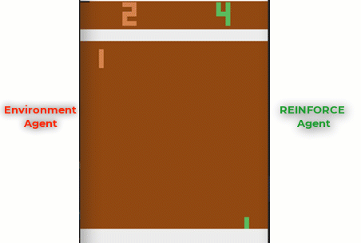
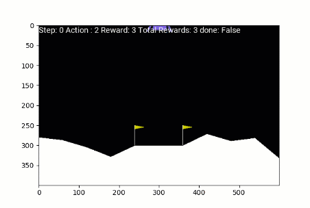

# REINFORCE Algorithm
Pytorch Implementation of REINFORCE algorithm on Pong, Lunar Lander and Cartplot + Medium Article

Checkout [Medium Article](https://medium.com/analytics-vidhya/reinforce-algorithm-taking-baby-steps-in-reinforcement-learning-994b2bf46b0e)  for explanation: : https://medium.com/analytics-vidhya/reinforce-algorithm-taking-baby-steps-in-reinforcement-learning-994b2bf46b0e

## Cartpole

## Pong

## Lunar Lander

